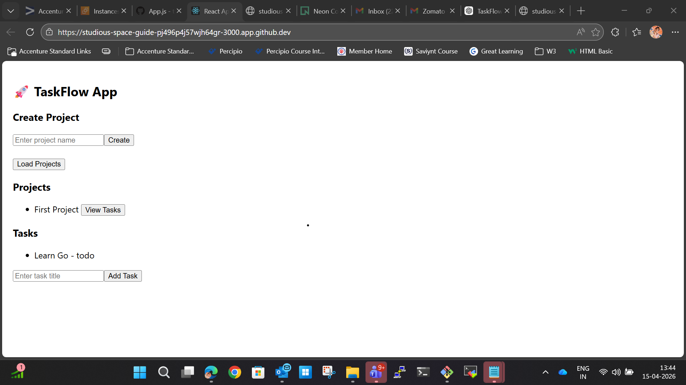
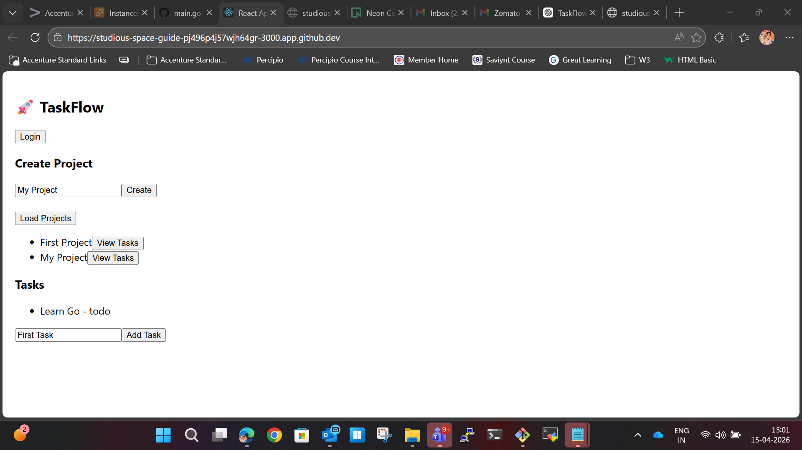

# Taskflow Project
# 🚀 TaskFlow – Full Stack Task Management App

## 📌 Overview

TaskFlow is a full-stack task management application that allows users to create projects and manage tasks efficiently.
Built using **React (Frontend)**, **Go with Gin (Backend)**, and **PostgreSQL (Database)**.

---

## 🛠️ Tech Stack

### Frontend

* React.js
* JavaScript (ES6)
* Fetch API

### Backend

* Go (Golang)
* Gin Framework
* JWT Authentication

### Database

* PostgreSQL

---

## ✨ Features

* 🔐 User Login (JWT Authentication)
* 📁 Create & View Projects
* 📝 Add Tasks to Projects
* 📋 View Tasks by Project
* 🔄 REST API Integration
* 🌐 Full-stack integration (Frontend + Backend)

---

## 📂 Project Structure

```
taskflow/
│
├── backend/
│   ├── main.go
│   ├── db.go
│   ├── schema.go
│   ├── project.go
│   ├── task.go
│   ├── auth.go
│   └── middleware.go
│
├── frontend/
│   ├── src/
│   │   └── App.js
│   └── package.json
│
└── README.md
```

---

## ⚙️ Setup Instructions

### 🔹 Backend Setup

1. Navigate to backend folder:

```bash
cd backend
```

2. Install dependencies:

```bash
go mod tidy
```

3. Run server:

```bash
go run .
```

4. Backend runs on:

```
http://localhost:8080
```

---

### 🔹 Frontend Setup

1. Navigate to frontend folder:

```bash
cd frontend
```

2. Install dependencies:

```bash
npm install
```

3. Start app:

```bash
npm start
```

4. Frontend runs on:

```
http://localhost:3000
```

---

## 🔗 API Endpoints

| Method | Endpoint            | Description      |
| ------ | ------------------- | ---------------- |
| GET    | /health             | Check server     |
| POST   | /login              | User login       |
| POST   | /projects           | Create project   |
| GET    | /projects           | Get all projects |
| POST   | /projects/:id/tasks | Create task      |
| GET    | /projects/:id/tasks | Get tasks        |

---

## 🔐 Authentication

* Uses JWT Token
* Token must be sent in headers:

```
Authorization: <your_token>
```

---

## 🚀 Deployment

* Frontend: Vercel
* Backend: Render / Railway

---

## 📸 Screenshots




---

## 💼 Resume Highlight

> Built a full-stack Task Management application using React, Go (Gin), and PostgreSQL with JWT authentication and REST APIs.

---

## 🙌 Future Improvements

* ✅ Task status update (Todo → Done)
* 🗑️ Delete project/task
* 🎨 UI enhancements (Bootstrap / Tailwind)
* 👤 User registration system

---

## 📬 Contact

**Name:** Varalakshmi Gopala
📧 Email: [varalakshmigopala79@gmail.com](mailto:varalakshmigopala79@gmail.com)
🔗 LinkedIn: https://linkedin.com/in/varalakshmigopala1826

---

⭐ If you like this project, give it a star on GitHub!


